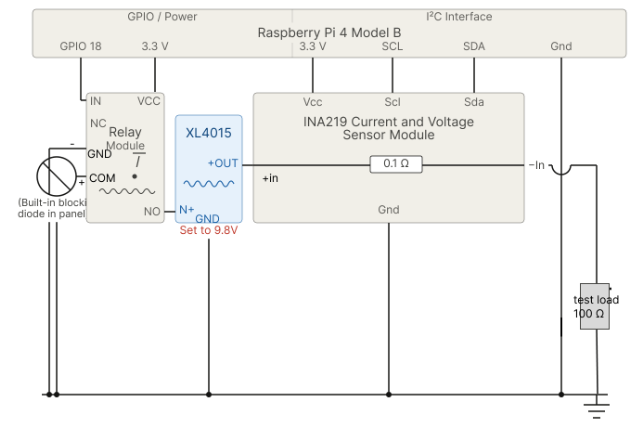

# Lab 3 - Solar Power Monitoring and IoT Dashboard
### Equipment
- Raspberry Pi 4
- Solar Panel (add more specs)
- XL4015 step-down module
- INA219 current/voltage sensor
- single-channel relay
- test load (100 ohm, 1 W resistor)

### Packages
see [requirements](../requirements.txt)

## Task 1

Circuit Wiring Diagram
